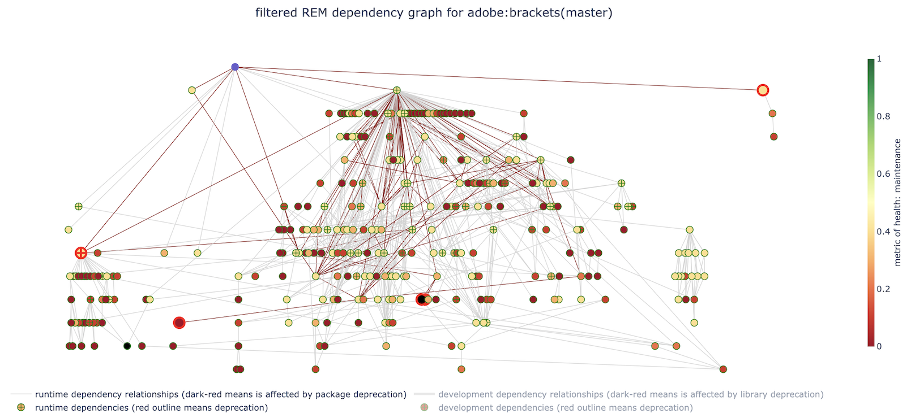

### Ripple Effect of Metrics dependency graph

The Ripple Effect of Metrics (REM) graph is a dependency graph designed to help developers identify vulnerable dependencies with lower metric-rating transitive dependencies in their dependency chains.

sample:

demo: http://turingmachine.org/rem_demo/

### Prerequisite

| Storage | RAM  | Language     | OS                                                          |
|---------|------|--------------|-------------------------------------------------------------|
| 2GB     | 10GB | Python 3.7.4 | Linux(Ubuntu 18.04)/MacOS(Catalina 10.15.5)/Windows 10 Home |

In this repository, we have provided a compressed database file that we generated on May, 2020. To uncompress it, go to `data\` folder and run command similar to `cat dep_network_npm_search.db.tar.gz.a* | tar xzvf -`. 

However, if you wish to collect the latest data, run `python3 preprocess.py` to generate a database that contains the latest NPM pakcages and scores.

#### Run on local machine

0. make sure you have created the database (see Prerequisite).
1. Run `pip3 install -r requirements.txt` to install Python libraries.
2. REM depends on GraphViz. To install it, go to https://graphviz.gitlab.io/download/ and look for right version for your OS.
3. Run `mkdir htmls` to create the folder that stores REM graphs.
4. `rem_graph_run_all.py` allows user to have all 8 REM graphs for four metrics of health (popularity, quality, maintenance, final) with and without Filtering. To run it, run `python3 rem_graph_run_all.py <github_url> [<out_folder>(htmls/)]` where `github_url` is the url to NPM application github repo, and optinal `out_folder` which is the output folder to store REM graphs, default is `htmls\`. For example, to generate every REM graph for [adobe/brackets](https://github.com/adobe/brackets), run `python3 rem_graph_run_all.py https://github.com/adobe/brackets`.
5. `rem_graph_run_single.py` allows user to generate REM graph on which metric of health and whether to use Filtering. To run it, run `python3 rem_graph_run_single.py <keyword> filter=True|False <github_url> [<out_folder>(htmls/)]` where `keyword` is one of the metrics of health (popularity, quality, maintenance, final), `filter=True|False` will toggle the graph filtering. For example, to generate a filtered REM graph with quality metric for [adobe/brackets](https://github.com/adobe/brackets), run `python3 rem_graph_run_single.py quality filter=True https://github.com/adobe/brackets`.
6. To view the REM graph generated, open it using a web browser (we recommend Chrome).

#### Run on local machine with Docker

The Dockerfile includes every environment for REM graph rendering.

0. make sure you have created the database (see Prerequisite).
1. Docker requirment: >= 10GB memory. Under `Preference -> Resources` of docker desktop, please set `Memory` to at least 10 GB.
2. under repo directory, run `docker build .` to build the image.
3. once the build is finished, run `docker run -it --name <name> <image id>` to bring the user to the CLI of the running Docker container for REM. `name` is the name of the image which user can reuse later by running `docker start -i <name>` and `image id` is the last unique string generated from step 2.
4. generate REM graphs:
    - `rem_graph_run_all.py` allows user to have all 8 REM graphs for four metrics of health (popularity, quality, maintenance, final) with and without Filtering. To run it, run `python3 rem_graph_run_all.py <github_url> [<out_folder>(htmls/)]` where `github_url` is the url to NPM application github repo, and optinal `out_folder` which is the output folder to store REM graphs, default is `htmls\`. For example, to generate every REM graph for [adobe/brackets](https://github.com/adobe/brackets), run `python3 rem_graph_run_all.py https://github.com/adobe/brackets`.
    - `rem_graph_run_single.py` allows user to generate REM graph on which metric of health and whether to use Filtering. To run it, run `python3 rem_graph_run_single.py <keyword> filter=True|False <github_url> [<out_folder>(htmls/)]` where `keyword` is one of the metrics of health (popularity, quality, maintenance, final), `filter=True|False` will toggle the graph filtering. For example, to generate a filtered REM graph with quality metric for [adobe/brackets](https://github.com/adobe/brackets), run `python3 rem_graph_run_single.py quality filter=True https://github.com/adobe/brackets`.
5. REM graphs will be created in `/htmls` folder inside Docker container
6. to export file from Docker container to local machine, keep the container running and run `docker cp <container id>:/htmls <target_dir>` from host. `container id` can be found by `docker ps`.

A complete Docker image is available on Dockerhub: https://hub.docker.com/repository/docker/sirumcz/rem .

#### Notes

 - The process of collecting the latest NPM package and score database with `preprocess.py` heaviliy depends on the internet speed, on a University lab environment, it usually takes 1 to 2 days to finish.
 - Running `rem_graph_run_all.py` that generates a set of 8 REM graphs on a 16-core Intel Core i9 MacBook Pro will take about 2 minutes to finish.
